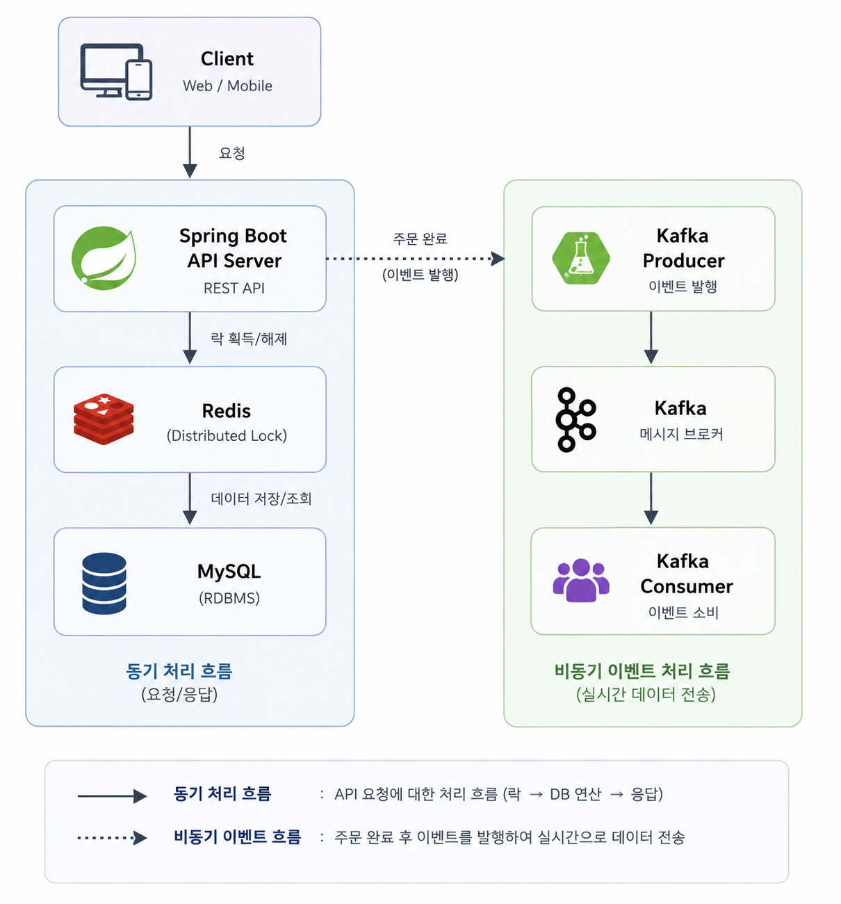
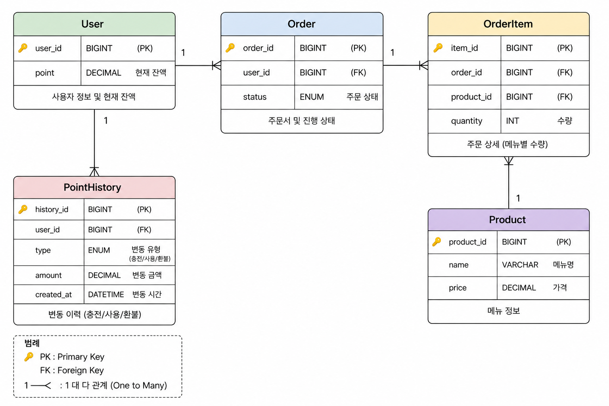

# 🏢 K사 서버 개발 프로젝트
# ☕ Coffee Order System

대용량 트래픽 및 다중 서버 환경에서도 안정적으로 동작하는 커피 주문 시스템입니다.

 

## 📌 프로젝트 소개

본 프로젝트는 포인트 기반 커피 주문 시스템으로,  
단순 CRUD 구현을 넘어 실제 운영 환경에서 발생할 수 있는 문제들을 고려하여 설계 및 구현했습니다.

특히 아래 내용을 중점적으로 고민했습니다.

- 다중 서버 환경에서의 동시성 제어
- 데이터 정합성 보장
- 실시간 주문 이벤트 처리
- 인기 메뉴 집계 정확성
- 확장 가능한 아키텍처 구성

---

# 🛠 Tech Stack

| Category | Tech |
|---|---|
| Language | Java 17 |
| Framework | Spring Boot 3 |
| Database | MySQL |
| ORM | Spring Data JPA |
| Cache / Lock | Redis |
| Messaging | Kafka |
| Build Tool | Gradle |
| Test | JUnit5, Mockito |
| Container | Docker |

---

# 🏗 System Architecture

 

### 구성 요소

- Spring Boot 기반 API 서버
- Redis 기반 분산 락 처리
- Kafka 기반 비동기 이벤트 처리
- MySQL 기반 데이터 영속성 관리
- 인기 메뉴 집계를 위한 Ranking 시스템

---

# 📊 ERD

---

# 📑 API Specification

| 기능 | Method | Endpoint | 상세 설명 |
|---|---|---|---|
| 메뉴 목록 조회 | GET | `/api/v1/menus` | 전체 커피 메뉴 리스트를 조회합니다. |
| 포인트 충전 | POST | `/api/v1/points/charge` | 사용자 ID와 금액을 받아 포인트를 충전합니다. |
| 주문 및 결제 | POST | `/api/v1/orders` | 잔액 차감 후 주문을 생성하고 이벤트를 발행합니다. |
| 인기 메뉴 조회 | GET | `/api/v1/menus/popular` | 최근 7일간 주문이 많은 메뉴 상위 3개를 조회합니다. |

---

# 🚀 핵심 기능

## 1. 메뉴 목록 조회

- 전체 메뉴 정보를 조회합니다.
- 메뉴 이름 및 가격 정보를 제공합니다.

---

## 2. 포인트 충전

- 사용자의 포인트를 충전합니다.
- 포인트 충전 내역을 저장합니다.
- 1원 = 1포인트 기준으로 처리됩니다.

---

## 3. 주문 및 결제

- 포인트를 차감하여 주문을 생성합니다.
- 주문 완료 후 Kafka 이벤트를 발행합니다.
- 실시간 주문 데이터 전송 구조를 구현했습니다.

---

## 4. 인기 메뉴 조회

- 최근 7일간 주문 데이터를 기준으로 인기 메뉴를 집계합니다.
- 주문 횟수 기준 상위 3개 메뉴를 반환합니다.

---

# 🔒 동시성 문제 해결 전략

주문 API의 경우 동일 사용자에 대한 다중 요청이 동시에 발생할 수 있습니다.

예를 들어:

- 동일 사용자의 중복 주문
- 포인트 중복 차감
- 인기 메뉴 주문 횟수 누락

위와 같은 문제를 해결하기 위해 Redis 기반 Distributed Lock을 적용했습니다.

 

## 선택 이유

### 1. 다중 서버 환경 대응

Synchronized 또는 JVM Lock은 단일 서버 환경에서만 동작하기 때문에  
멀티 인스턴스 환경에서는 Redis 기반 분산 락이 필요했습니다.

### 2. 데이터 정합성 보장

동일 사용자에 대한 주문 요청을 직렬화하여  
포인트 차감 및 주문 생성 과정의 정합성을 보장했습니다.

### 3. 확장성 고려

서버 인스턴스가 증가하더라도 동일한 Lock 기준으로 동작할 수 있도록 설계했습니다.

 

## Lock 실패 전략

Retry with Backoff 전략을 적용했습니다.

- 일시적인 경합 상황에서는 재시도를 수행
- 사용자 요청 실패율 감소
- 과도한 Busy Waiting 방지

---

# 📦 데이터 일관성 전략

주문 생성과 포인트 차감은 하나의 트랜잭션으로 처리했습니다.

이를 통해:

- 주문은 생성되었지만 포인트 차감은 실패하는 문제
- 포인트는 차감되었지만 주문 생성은 실패하는 문제

를 방지했습니다.

 

또한 Kafka 이벤트 발행 과정에서 발생할 수 있는 문제를 고려하여:

- 이벤트 발행 실패 로그 처리
- 재시도 전략 고려
- Consumer 장애 대응 가능 구조

를 적용했습니다.

---

# 📨 Kafka 적용 이유

주문 데이터를 실시간 데이터 플랫폼으로 전송하기 위해 Kafka를 사용했습니다.

 

## Kafka 적용 효과

### 비동기 처리

주문 처리 로직과 데이터 수집 로직을 분리하여  
응답 속도 저하를 최소화했습니다.

### 서비스 간 결합도 감소

Producer와 Consumer를 분리하여  
향후 데이터 분석 플랫폼 확장이 가능하도록 설계했습니다.

### 실시간 이벤트 처리

주문 이벤트를 실시간으로 발행하여  
추후 통계 및 분석 시스템과 연동 가능한 구조를 고려했습니다.

---

# 📈 인기 메뉴 집계 전략

최근 7일간의 주문 데이터를 기준으로 인기 메뉴를 집계했습니다.

## 고려 사항

- 주문 횟수 정확성 보장
- 동시 주문 환경 대응
- 빠른 조회 성능 확보

 

이를 위해:

- 주문 완료 기준으로 데이터 집계
- 동시성 제어 적용
- 랭킹 조회 성능 고려

방식으로 구현했습니다.

---

# 🧪 테스트 전략

## 단위 테스트

- 서비스 로직 검증
- 포인트 충전 검증
- 주문 생성 검증
- 예외 상황 검증

---

## 통합 테스트

- 주문 생성부터 결제 완료까지 전체 흐름 검증
- DB 연동 검증
- Kafka 이벤트 발행 검증

---

## 동시성 테스트

동일 사용자에 대해 동시에 주문 요청을 발생시켜:

- 포인트 중복 차감 여부
- 데이터 정합성
- Lock 정상 동작 여부

를 검증했습니다.

---

# ⚠️ Troubleshooting

과제 진행 중 발생했던 문제들과 해결 과정을 TIL 형태로 정리했습니다.

👉 https://poten97.tistory.com/50

 

### 주요 내용

- Redis Lock 적용 과정
- Retry 전략 선택 이유
- Kafka 직렬화/역직렬화 문제
- 데이터 정합성 문제 해결
- 테스트 코드 작성 과정

---

# ▶️ 실행 방법 (터미널 입력)

## Docker 실행

docker-compose up -d

## 어플리케이션 실행

./gradlew bootRun

## 테스트 실행

./gradlew test

---

# 💭 고민했던 부분

이번 과제에서는 단순 기능 구현보다
실제 운영 환경에서 발생할 수 있는 문제 상황을 고려하는 데 집중했습니다.

특히 아래 내용을 중요하게 고민했습니다.

- 다중 서버 환경에서의 동시성 처리
- 데이터 정합성 보장
- 비동기 이벤트 처리 구조
- 장애 상황 대응 전략
- 테스트 가능한 구조 설계

또한 단순히 기능이 동작하는 수준이 아니라
“왜 이런 방식으로 설계했는가”를 설명할 수 있는 구조를 목표로 구현했습니다.
